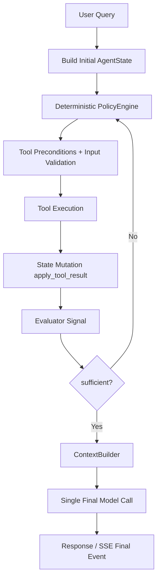

# Agent Core v3 - Documentacion tecnica completa

## 1. Nombre del servicio
Agent Core API v3

## 2. Objetivo del servicio
Agent Core v3 implementa un agente hibrido controlado para consultas de materiales con estas garantias de arquitectura:
- Control local deterministico del ciclo de decision.
- Evaluacion asistida por modelo, pero acotada a senales (sin control del flujo).
- Ejecucion de herramientas con contratos estrictos (schema de entrada/salida).
- Una sola llamada final de modelo para redactar la respuesta de usuario.

## 3. Arquitectura funcional v3



Componentes clave:
- `AgentState`: fuente unica de verdad del request.
- `PolicyEngine`: decide la herramienta por `argmax` con scoring local.
- `ToolRegistry`: valida precondiciones y schemas.
- `run_loop`: orquesta iteraciones, errores y termino.
- `Evaluator`: emite `sufficient`, `confidence`, `missing_information`.
- `CompletionServiceV3`: orquesta el flujo sync y SSE.

## 4. Flujo end-to-end (paso a paso)
1. Entra una solicitud a `POST /v3/completions`.
2. Se construye `AgentState` con presupuesto (`max_iterations`, `max_tool_calls`, `max_context_tokens`, `max_wall_time_ms`).
3. `run_loop` ejecuta iteraciones mientras `state.can_continue()` sea verdadero.
4. En cada iteracion:
   - `PolicyEngine.decide(...)` selecciona una herramienta valida.
   - `ToolRegistry.validate_input(...)` valida payload de entrada.
   - Se ejecuta herramienta.
   - `ToolRegistry.validate_output(...)` valida salida.
   - `apply_tool_result(...)` muta estado de evidencia.
   - `Evaluator.evaluate(...)` produce senal estructurada.
5. Si `feedback.sufficient` es verdadero, termina con `stop_reason=sufficient_evidence`.
6. Se construye contexto final (`ContextBuilder`) y se realiza una sola llamada final al modelo.
7. Se persiste traza JSON por `request_id`.
8. Se devuelve respuesta normal o secuencia SSE.

## 5. Policy deterministica (detalle completo)

### 5.1 Clasificacion de intent
`PolicyEngine.classify_intent(query)` usa heuristicas deterministicas por palabras clave:
- `compare`: compare, versus, vs
- `constraint_validation`: constraint, must, at least, less than
- `document_research`: paper, document, literature
- `structure_generation`: structure, cif, poscar, crystal
- fallback: `material_lookup`

### 5.2 Candidatos por intent
- `material_lookup` -> `query_materials_database`, `search_scientific_documents`, `generate_crystal_structure`
- `compare` -> `compare_materials`, `query_materials_database`
- `constraint_validation` -> `validate_material_constraints`, `query_materials_database`
- `document_research` -> `search_scientific_documents`, `extract_document_insights`
- `structure_generation` -> `generate_crystal_structure`, `query_materials_database`

### 5.3 Filtro por precondiciones
Antes de puntuar, solo sobreviven herramientas para las que `registry.can_run(tool, state)` es verdadero.
Si no queda ninguna, se lanza `NoValidToolError` y el loop termina con `stop_reason=no_valid_tools_available`.

### 5.4 Scoring local y seleccion
Formula:

`score = w_missing*missing_coverage + w_gain*information_gain + w_compat*compatibility - w_cost*cost`

Pesos actuales:
- `missing_coverage`: 0.45
- `information_gain`: 0.30
- `compatibility`: 0.20
- `cost`: 0.15

Costo por herramienta (normalizado):
- `query_materials_database`: 0.35
- `compare_materials`: 0.20
- `validate_material_constraints`: 0.25
- `search_scientific_documents`: 0.55
- `extract_document_insights`: 0.70
- `generate_crystal_structure`: 0.40

Seleccion final: `argmax(score)` entre herramientas disponibles.

### 5.5 Construccion deterministica de argumentos
`_build_arguments` genera payload por tipo de herramienta:
- `query_materials_database`: extrae `material_id` (`mp-####`) o formula, fallback `Si`.
- `compare_materials`: usa hasta 5 materiales del estado.
- `validate_material_constraints`: usa constraints del estado o fallback estandar.
- `search_scientific_documents`: usa query del usuario y foco opcional.
- `extract_document_insights`: usa titulos de documentos del estado.
- `generate_crystal_structure`: usa primer material del estado o fallback `mp-149`.

## 6. Evaluacion acotada (detalle completo)

### 6.1 Rol del evaluator
El evaluator es un componente de calidad de evidencia, no de control:
- No elige herramienta.
- No modifica policy ni scores.
- No fuerza acciones.
- Solo emite senales estructuradas.

Contrato de salida esperado:
```json
{
  "sufficient": false,
  "confidence": 0.65,
  "missing_information": ["comparison"],
  "reasoning": "need more evidence"
}
```

### 6.2 Prompt del evaluator
El prompt incluye:
- Query original.
- Nombre de herramienta ejecutada.
- Salida de herramienta truncada de forma segura.
- Materiales conocidos.
- Documentos conocidos.

Se exige salida JSON estricta.

### 6.3 Robustez y fallback
Si falla el endpoint remoto o el parseo JSON:
- Se devuelve fallback local:
  - `sufficient=false`
  - `confidence=0.4`
  - `missing_information=["additional_evidence"]`
  - `reasoning="fallback_evaluation"`

El parseo intenta:
1. `json.loads(text)` directo.
2. Extraer substring entre la primera `{` y la ultima `}`.

## 7. Loop deterministico y condiciones de termino

### 7.1 Orden exacto por iteracion
1. `state.can_continue()` verifica limites duros.
2. `policy.decide(...)`.
3. Deteccion de estancamiento por repeticion de herramienta.
4. Validacion de input schema.
5. Ejecucion de herramienta.
6. Validacion de output schema.
7. Registro de `ToolExecutionRecord`.
8. Mutacion de estado (`apply_tool_result`).
9. Evaluacion y registro de `EvaluatorFeedback`.
10. Actualizacion de presupuesto de contexto.

### 7.2 Stop reasons soportados
Por limites (`AgentState.can_continue`):
- `max_iterations`
- `max_tool_calls`
- `max_context_tokens`
- `max_wall_time_ms`

Por loop/control:
- `sufficient_evidence`
- `no_valid_tools_available`
- `stall_detected`
- `tool_input_validation_failed`
- `tool_output_validation_failed`
- `<error_code_de_herramienta>` si una herramienta retorna error
- `budget_exhausted` como fallback final

## 8. Catalogo de herramientas v3 (contratos y precondiciones)

### 8.1 query_materials_database
- Input: `material_query` (material_id/formula/chemical_system), `filters` opcional.
- Output: `materials[]`, `count`.
- Preconditions: siempre disponible.
- Estado que actualiza: `materials_found`, bandera `materials_loaded`.

### 8.2 compare_materials
- Input: `material_ids[]`, `properties_to_compare[]`.
- Output: comparativa estructurada.
- Preconditions: al menos 2 materiales en estado.
- Estado que actualiza: `properties_collected.comparison`.

### 8.3 validate_material_constraints
- Input: `constraints`.
- Output: validacion de cumplimiento de restricciones.
- Preconditions: constraints y materiales disponibles.
- Estado que actualiza: `properties_collected.constraint_validation`.

### 8.4 search_scientific_documents
- Input: `query`, `material_focus`, `max_results`.
- Output: `documents[]`, `count`.
- Preconditions: siempre disponible.
- Estado que actualiza: `documents`.

### 8.5 extract_document_insights
- Input: `documents[]`, `focus_area`.
- Output: `insights[]`.
- Preconditions: `state.documents` no vacio.
- Estado que actualiza: `extracted_insights`.
- Nota: usa modelo remoto, con fallback local si falla.

### 8.6 generate_crystal_structure
- Input: `material_id`, `format` (`cif|poscar|json`).
- Output: estructura y parametros de red.
- Preconditions: al menos un material en estado.
- Estado que actualiza: `properties_collected.structure`.

## 9. Endpoints HTTP internos y externos

### 9.1 Endpoints expuestos por Agent Core
- `POST /v3/completions`
  - Modo normal JSON.
  - Modo streaming SSE cuando `request.stream=true` o `Accept: text/event-stream`.

Nota importante:
- En la implementacion actual no existe `GET /health`.

### 9.2 Endpoints externos consumidos por Agent Core
Dependen de `AGENTS_URL` (default `http://agents:8003`):

1. Evaluator:
- `POST {AGENTS_URL}/v1/completions`
- Payload: `history`, `temperature=0.1`, `max_tokens=300`

2. Final answer generation:
- `POST {AGENTS_URL}/v1/completions`
- Payload: `history` (system=context, user=query), `temperature`, `max_tokens`

3. Extract insights tool:
- `POST {AGENTS_URL}/v1/completions`
- Payload: `history` con prompt de extraccion estructurada, `temperature=0.1`, `max_tokens=300`

No se llaman endpoints remotos de policy; la policy es 100% local deterministica.

### 9.3 Adaptacion de formato y limpieza de respuesta
La integracion con `agents` usa una adaptacion explicita y deterministica:
- `messages -> history` con preservacion de roles (`system`, `user`, `assistant`).
- Limpieza local de salida en `api/v3/model_io.py` (`clean_model_response`) para remover
  artefactos como `Assistant:`, `User:`, `System:` y tags `[Response]`.

Esto mantiene la compatibilidad de prompts existentes sin introducir heuristicas opacas.

## 10. SSE: como se generan los eventos

### 10.1 Activacion de SSE
SSE se activa si ocurre cualquiera de estas condiciones:
- `stream=true` en `CompletionRequestV3`.
- Header `Accept` contiene `text/event-stream`.

### 10.2 Formato de cada evento
`CompletionServiceV3._format_sse` serializa con este formato:
```text
event: <event_name>
data: <json_payload>

```
Se usa `json.dumps(..., ensure_ascii=True)` para payload ASCII-safe.

### 10.3 Secuencia emitida
Orden fijo del stream:
1. `start`
2. `loop_done`
3. `final`

Payload por evento:
- `start`: `request_id`, `query`
- `loop_done`: `request_id`, `stop_reason`, `iterations`, `tool_calls`
- `final`: `request_id`, `response` completo serializado

Headers HTTP de streaming:
- `Content-Type: text/event-stream`
- `Cache-Control: no-cache`
- `Connection: keep-alive`
- `X-Accel-Buffering: no`

## 11. Contratos de entrada/salida del endpoint

### 11.1 Request `CompletionRequestV3`
Campos relevantes:
- `query: str`
- `stream: bool = false`
- `temperature: float = 0.2`
- `max_tokens_for_response: int = 512`
- `max_iterations: int [1..32]`
- `max_tool_calls: int [1..32]`
- `max_context_tokens: int [256..8192]`
- `max_wall_time_ms: int [1000..120000]`

### 11.2 Response `CompletionResponseV3`
Campos:
- `id`
- `object = "text_completion"`
- `choices[]` con `text`
- `usage` (`prompt_tokens`, `completion_tokens`, `total_tokens`, `context_tokens`)
- `metadata`

Metadata reportada:
- `iterations_count`
- `tool_calls_count`
- `context_tokens_used`
- `stop_reason`
- `elapsed_ms`
- `materials_found`
- `documents_found`
- `insights_found`
- `evaluator_feedback` (ultimos 3)

## 12. Persistencia de trazas y observabilidad
- Se persiste un archivo JSON por request en `AGENT_TRACE_DIR`.
- Nombre de archivo: `{request_id}.json`.
- Incluye:
  - estado de ejecucion y presupuesto,
  - historial de tool calls,
  - policy trace,
  - evaluator feedback,
  - evidencia agregada,
  - respuesta final.

## 13. Variables de entorno
- `AGENTS_URL` (default: `http://agents:8003`)
- `CORS_ALLOW_ORIGINS` (default: `http://localhost:3000`)
- `AGENT_TRACE_DIR` (default: `agent_core/data/traces`)
- `AGENT_EVALUATOR_MODEL` (default: `Qwen2.5-7B-Instruct-1M`)
- `AGENT_INSIGHTS_MODEL` (default: `Qwen2.5-7B-Instruct-1M`)

## 14. Decisiones de diseno importantes
- Policy local deterministica: reproducibilidad y auditabilidad.
- Evaluator acotado: evita acoplar control del agente al modelo.
- Validacion de schemas de tool I/O: reduce propagacion de errores.
- Estado unico (`AgentState`): evita fuentes paralelas de verdad.
- Una llamada final al modelo: separa adquisicion de evidencia y redaccion final.
