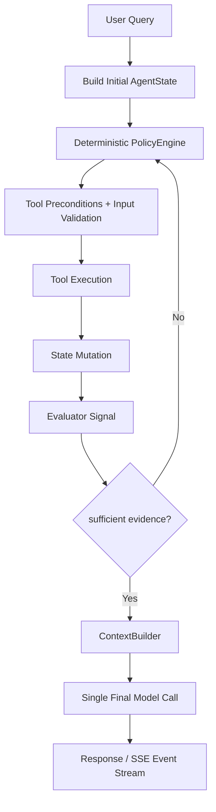

# Agent Core v3 - Documentación General

**Descripción de propósito, arquitectura y garantías del sistema**

---

## 1. ¿Qué es Agent Core v3?

Agent Core v3 es un **agente híbrido controlado** para consultas sobre materiales científicos. Combina:
- Decisiones locales determinísticas
- Evaluación asistida por modelo (pero acotada)
- Ejecución de herramientas con contratos estrictos
- Una única llamada final al modelo para redactar la respuesta

Está diseñado para garantizar **reproducibilidad, observabilidad y control** sobre el comportamiento del agente.

---

## 2. Objetivo del Servicio

Proporcionar un endpoint HTTP que acepte consultas de materiales y retorne respuestas informadas mediante:

1. **Control Local Determinístico:** La selección de herramientas y el flujo se deciden mediante políticas locales, sin depender del modelo.
2. **Evaluación Acotada:** Un evaluador (LLM) emite señales sobre calidad de evidencia, pero NO controla el flujo.
3. **Herramientas con Contratos:** Cada herramienta valida entrada/salida contra JSON schemas estrictos.
4. **Una Llamada Final:** Solo se llama al modelo UNA VEZ para redactar la respuesta, después de acumular toda la evidencia.

---

## 3. Arquitectura Funcional



### Componentes Clave

| Componente | Función | Determinístico |
|---|---|---|
| **AgentState** | Fuente única de verdad: materiales, documentos, insights, restricciones | ✅ |
| **PolicyEngine** | Clasifica intent, puntúa herramientas, selecciona por argmax | ✅ |
| **ToolRegistry** | Valida esquemas entrada/salida, verifica precondiciones | ✅ |
| **run_loop** | Orquesta iteraciones, maneja errores, verifica terminación | ✅ |
| **Evaluator** | Emite señales (sufficient, confidence, missing_info) | ⚠️ (LLM) |
| **ContextBuilder** | Compila evidencia en contexto para response final | ✅ |
| **CompletionServiceV3** | Orquesta el flujo HTTP, maneja SSE | ✅ |

---

## 4. Flujo End-to-End (Visión General)

```
1. Usuario envía POST /v3/completions con query + presupuesto

2. Se crea AgentState con límites:
   ├─ max_iterations (default 10)
   ├─ max_tool_calls (default 15)
   ├─ max_context_tokens (default 4096)
   └─ max_wall_time_ms (default 60000)

3. Loop iterativo:
   ├─ PolicyEngine clasifica intent y selecciona herramienta
   ├─ Herramienta ejecuta (con validación entrada/salida)
   ├─ AgentState se actualiza con resultados
   ├─ Evaluador emite señal de calidad
   └─ Si sufficient == true O límites excedidos → ir a paso 4

4. ContextBuilder compila toda la evidencia en un contexto

5. LLM (LLAMADA ÚNICA) redacta respuesta basada en contexto

6. Se persiste traza JSON completa por request_id

7. Se retorna:
   ├─ JSON con response + metadata
   └─ O secuencia SSE si stream=true
```

---

## 5. Garantías Arquitectónicas

### 5.1 Determinismo del Ciclo de Decisión

La selección de herramientas es **100% determinística** y no depende de modelo:

```
Intent Classification    → (heurísticas por palabras clave)
Precondition Filtering   → (booleano contra state)
Policy Scoring          → (fórmula numérica)
Tool Selection          → (argmax de scores)
Argument Building       → (reglas por tipo)
```

**Garantía:** Misma query + mismo state → siempre misma selección de herramienta.

### 5.2 Evaluación Acotada

El evaluador (LLM) **NO controla el flujo**:

```
Lo que NO hace:
├─ NO elige herramienta siguiente
├─ NO modifica pesos o scores
├─ NO fuerza continuación
└─ NO rompe el flujo

Lo que SÍ hace:
├─ Emite: sufficient (bool), confidence (float), missing_info (array)
└─ Policy lo usa para decidir si continuar iterando
```

**Garantía:** Comportamiento predecible y auditable.

### 5.3 Validación de Contratos

Cada herramienta tiene:

```
Input Schema:  Valida parámetros ANTES de ejecutar
Output Schema: Valida resultado DESPUÉS de ejecutar
Preconditions: Define qué debe existir en AgentState
```

**Garantía:** Propagación de errores clara y controlada.

### 5.4 Una Sola Llamada Final al Modelo

```
NO:
├─ Llamadas inline (para seleccionar herramientas)
├─ Llamadas paralelo (para comparaciones)
└─ Llamadas reiterativas (para refinamiento)

SÍ:
└─ UNA LLAMADA después de evidencia completa → redacta
```

**Garantía:** Costo predecible, latencia controlada.

---

## 6. Herramientas Disponibles

### Estado: Producción ✅

| Herramienta | ¿Qué Hace? | Entrada | Salida |
|---|---|---|---|
| **query_materials** | Busca en Materials Project | material_id ó formula ó chemsys | Lista de materiales |
| **search_documents** | Busca papers científicos | query | Lista de documentos |
| **validate_constraints** | Valida restricciones | constraints | Materiales que cumplen |
| **extract_insights** | Extrae insights (LLM) | documents[] | Insights estructurados |

### Estado: STUB (No Producción) 🟡

| Herramienta | Descripción | Acción |
|---|---|---|
| **compare_materials** | Comparar materiales | Necesita implementación |
| **generate_structure** | Generar estructura CIF/POSCAR | Necesita integración |

---

## 7. Endpoints HTTP

### `POST /v3/completions`

**Solicitud:**
```json
{
  "query": "Find materials with band gap > 2.0 eV",
  "stream": false,
  "temperature": 0.2,
  "max_iterations": 10,
  "max_tool_calls": 15,
  "max_context_tokens": 4096,
  "max_wall_time_ms": 60000
}
```

**Respuesta (JSON):**
```json
{
  "id": "req-abc123",
  "object": "text_completion",
  "choices": [{
    "text": "I found 5 materials with band gap > 2.0 eV..."
  }],
  "metadata": {
    "stop_reason": "sufficient_evidence",
    "iterations_count": 3,
    "tool_calls_count": 3,
    "elapsed_ms": 3500,
    "materials_found": 5,
    "documents_found": 12
  }
}
```

**Respuesta (SSE):**
```
event: start
data: {"request_id": "req-abc123"}

event: loop_done
data: {"stop_reason": "sufficient_evidence", "iterations": 3}

event: final
data: {"response": "I found 5 materials..."}
```

---

## 8. Variables de Entorno

```bash
# API Keys
MP_API_KEY=your_key
SEMANTIC_SCHOLAR_API_KEY=optional_key
CROSSREF_EMAIL=your_email@example.com

# URLs de Servicios
AGENTS_URL=http://agents:8003
AGENTS_SERVICE_URL=http://agents:8000

# Modelos
AGENT_EVALUATOR_MODEL=Qwen2.5-7B-Instruct-1M
AGENT_INSIGHTS_MODEL=Qwen2.5-7B-Instruct-1M

# Configuración
CORS_ALLOW_ORIGINS=http://localhost:3000
AGENT_TRACE_DIR=agent_core/data/traces
```

---

## 9. Decisiones de Diseño

### ¿Por qué Policy Local?
```
✅ Determinístico: Reproduce siempre igual
✅ Rápido: Sin LLM call
✅ Auditable: Reglas claras
✅ Controlable: Ajusta pesos → cambia comportamiento
```

### ¿Por qué Evaluador Acotado?
```
✅ Separa concerns: Evidence gathering ≠ Policy control
✅ Previene loops infinitos: Policy decide, evaluador señala
✅ Bajo costo: Señal simple
✅ Graceful degradation: Fallback si LLM falla
```

### ¿Por qué Validación de Esquemas?
```
✅ Errores locales: Falla rápido
✅ Contrato explícito: JSON Schema define interface
✅ Testing simple: Valida contra spec
✅ Composable: Múltiples herramientas sin acoplamiento
```

### ¿Por qué Una Sola Llamada?
```
✅ Costo predecible: 1 LLM call
✅ Coherencia: Respuesta basada en contexto acumulado
✅ Observabilidad: Todo visible antes de escribir
✅ Control: Prompt final personalizable
```

---

## 10. Tabla Resumen de Herramientas

| Herramienta | Status | Tiempo | Costo | Determinístico |
|---|---|---|---|---|
| query_materials | ✅ Prod | 150-3000ms | Bajo | 100% |
| search_documents | ✅ Prod | 600-4000ms | Medio | 99% |
| validate_constraints | ✅ Prod | 20-50ms | Muy bajo | 100% |
| extract_insights | ✅ Prod | 500-3000ms | Alto | 90% |
| compare_materials | 🟡 STUB | - | - | - |
| generate_structure | 🟡 STUB | - | - | - |

---

## 11. Condiciones de Terminación

El loop termina si se cumple **cualquiera** de:

**✅ Successful Termination:**
```
sufficient_evidence    → Evaluador indica evidencia suficiente
max_iterations        → Iteraciones máximas alcanzadas
max_tool_calls        → Tool calls máximas alcanzadas
max_context_tokens    → Contexto máximo alcanzado
max_wall_time_ms      → Tiempo máximo alcanzado
```

**❌ Error Termination:**
```
no_valid_tools        → Ninguna herramienta disponible
tool_validation_failed → Input/output schema inválido
tool_error            → Herramienta retornó error
```

---

## 12. Flujo de Información

```
User Query
    ↓
Policy (determinístico) selecciona herramienta
    ↓
Tool execution → acumula evidencia
    ↓
Evaluator (LLM) emite signals (no controla)
    ↓
Policy decide si continuar
    ↓
[Loop until sufficient]
    ↓
ContextBuilder compila evidencia
    ↓
LLM (UNA LLAMADA) redacta respuesta
    ↓
Response + Metadata + Persist Trace
```

---

## 13. Manejo de Errores

### Validación
```
Input malformado     → VALIDATION_ERROR → Stop
API call falsa       → API_ERROR → Evaluador decide
JSON parsing falla   → UNEXPECTED_ERROR → Log & continue
Schema inválido      → VALIDATION_ERROR → Stop
```

### Fallback Graceful
```
Sin evaluador        → fallback conservador
Sin embeddings       → TF-IDF graceful degradation
Tool timeout         → error explícito
LLM falla           → insights sintéticos validados
```

---

## 14. Observabilidad

### Request Tracing

Cada request genera un JSON persistido en `AGENT_TRACE_DIR/{request_id}.json`:

```json
{
  "request_id": "req-abc123",
  "query": "Find materials...",
  "tool_execution_history": [
    {"iteration": 1, "tool": "query_materials", "elapsed_ms": 450},
    ...
  ],
  "evaluator_feedback_history": [
    {"sufficient": false, "confidence": 0.65},
    ...
  ],
  "final_response": "I found...",
  "metadata": {
    "stop_reason": "sufficient_evidence",
    "total_iterations": 3,
    "total_tool_calls": 3
  }
}
```

---

## 15. Inicio Rápido

### Instalación

```bash
cd agent_core/
pip install -r requirements.txt
cp .env.example .env
# Editar .env con credenciales
```

### Ejecutar

```bash
python -m src.api.app
# Swagger UI en http://localhost:8000/docs
```

### Probar

```bash
curl -X POST http://localhost:8000/v3/completions \
  -H "Content-Type: application/json" \
  -d '{
    "query": "Find silicon with band gap > 1 eV",
    "max_iterations": 5
  }'
```

---

## 16. Para Detalles Técnicos Profundos

Consulta **[TECHNICAL_DOCUMENTATION_AGENT_CORE.md](TECHNICAL_DOCUMENTATION_AGENT_CORE.md)** para:

- **Policy Engine:** Fórmulas de scoring, ejemplos numéricos, clasificación de intent
- **Evaluator:** Prompt template, fallback robusto, JSON parsing
- **Loop:** Orden exacto de pasos cada iteración, todos los stop reasons
- **AgentState:** Estructura completa, métodos críticos, mutaciones
- **Cada Herramienta:** Contratos JSON Schema entrada/salida, flujos internos, lógica de ranking, costos computacionales, matrices de error
- **ToolRegistry:** Validación de esquemas, precondiciones
- **Endpoints:** Request/response schemas completos con ejemplos
- **Persistencia:** Formato de trazas JSON, observabilidad
- **Variables de Entorno:** Lista completa con descripciones detalladas

---

**Última actualización:** Marzo 24, 2026  
**Versión:** v3.0  
**Rama:** Documentación consolidada
