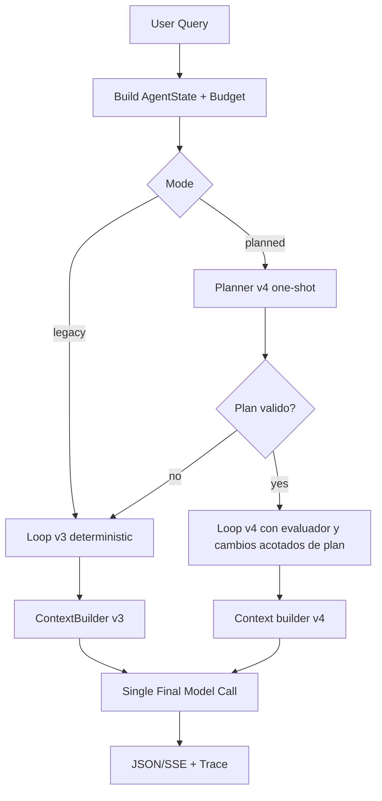

# Agent Core - Documentación General

**Descripción general del propósito, arquitectura y garantías del sistema**

---

## 1. ¿Qué es Agent Core?

Agent Core es un agente híbrido controlado para consultas sobre materiales científicos.
Combina:
- política local determinística,
- evaluación asistida por modelo con rol acotado,
- ejecución de herramientas bajo contratos estrictos,
- una llamada final única al modelo para redacción.

Su objetivo principal es mantener reproducibilidad, observabilidad y control operativo.

---

## 2. Objetivo del servicio

Exponer un endpoint HTTP (`POST /v3/completions`) que reciba una consulta y produzca una respuesta basada en evidencia acumulada mediante loop de herramientas.

Principios:
1. El loop de ejecución es determinístico y controlado por presupuesto.
2. Las herramientas se ejecutan con validación de entrada/salida.
3. El evaluador emite señales de suficiencia, pero no ejecuta herramientas ni altera contratos.
4. La redacción final se hace en una sola llamada al modelo al terminar el loop.

---

## 3. Modos de ejecución

`agent_core` soporta dos modos seleccionados por variable de entorno:
- `AGENT_POLICY_MODE=legacy`
- `AGENT_POLICY_MODE=planned`

### 3.1 Modo legacy
- Clasifica intención por heurísticas de texto.
- Selecciona herramientas por scoring determinístico + precondiciones.
- Construye argumentos de forma determinística.

### 3.2 Modo planned
- Ejecuta un runtime dedicado v4 (planner + loop + evaluator propios de v4).
- Flujo real:
  1. construye catálogo de herramientas desde `ToolRegistry`,
  2. solicita plan one-shot vía `POST {AGENTS_URL}/v2/completions`,
  3. valida y filtra el plan localmente,
  4. ejecuta el plan en loop v4,
  5. permite modificaciones acotadas del plan durante el loop (máximo 2, sólo después del cursor).
- Si el planner falla o devuelve plan inválido, aplica fallback inmediato a ejecución legacy.

---

## 4. Arquitectura funcional (alto nivel)



---

## 5. Flujo end-to-end (resumen)

1. Usuario envía `POST /v3/completions`.
2. Se crea `AgentState` con límites (`max_iterations`, `max_tool_calls`, `max_context_tokens`, `max_wall_time_ms`).
3. En modo `legacy`, por iteración:
  - policy determinística decide herramienta,
  - se valida contrato de entrada,
  - se ejecuta herramienta,
  - se valida contrato de salida,
  - se muta estado,
  - evaluador v3 emite señal de suficiencia para stop gating.
4. En modo `planned`, por iteración:
  - se ejecuta el paso en cursor del plan v4,
  - se valida entrada/salida,
  - evaluador v4 decide continuar/parar y puede sugerir cambios acotados de plan.
5. Al cumplirse condición de término, se construye contexto final.
6. Se hace una sola llamada final al modelo de respuesta.
7. Se persiste traza y se devuelve JSON o SSE.

---

## 6. Garantías arquitectónicas

### 6.1 Invariante de control
Existe una sola entrada pública (`/v3/completions`) y dos runtimes internos:
- `legacy` usa loop v3 determinístico.
- `planned` usa runtime v4 basado en plan.

### 6.2 Determinismo operativo
- Selección final de herramienta y validación de contratos se mantienen bajo reglas locales.
- Precondiciones y validaciones bloquean pasos inválidos.

### 6.3 Evaluación acotada
El evaluador sólo aporta señales de calidad (`suficiencia`, `confianza`, `riesgo`) para el criterio de parada.
No selecciona herramientas ni ejecuta acciones.

### 6.4 Coste predecible de redacción
La respuesta final del asistente se produce con una única llamada de modelo posterior a la recolección de evidencia.

---

## 7. Herramientas registradas

Catálogo actual en `src/tools/config.py`:
- `query_materials_database`
- `validate_material_constraints`
- `search_scientific_documents`
- `document_rag`
- `generate_crystal_structure`

---

## 8. Endpoint principal

### `POST /v3/completions`

Entrada típica:
```json
{
  "query": "Find materials with band gap > 2.0 eV",
  "stream": false,
  "temperature": 0.2,
  "max_iterations": 8,
  "max_tool_calls": 8,
  "max_context_tokens": 2048,
  "max_wall_time_ms": 30000
}
```

Salida:
- respuesta textual en `choices[0].text`,
- metadata de ejecución (stop_reason, iteraciones, tool_calls, tiempos, conteos de evidencia).

Si `stream=true`, los eventos SSE dependen del modo:
- `legacy`: `start`, `loop_done`, `final`
- `planned`: `start`, `tool_start`, `tool_result`, `evaluation`, `plan_modified` (opcional), `stop`, `final`

---

## 9. Variables de entorno (visión general)

Variables principales en agent_core:
- `AGENT_POLICY_MODE` (`legacy|planned`)
- `AGENTS_URL`
- `AGENTS_SERVICE_URL`
- `AGENT_EVALUATOR_STOP_TAU`
- `AGENT_PLANNER_MODEL`
- `AGENT_EVALUATOR_MODEL`
- `MP_API_KEY`
- `SEMANTIC_SCHOLAR_API_KEY`
- `CROSSREF_EMAIL`
- `UNPAYWALL_EMAIL`
- `CORS_ALLOW_ORIGINS`
- `AGENT_TRACE_DIR`

Nota de ownership:
- La selección de modelos LLM está centralizada en servicio `agents`.
- `agent_core` consume esos modelos vía contratos HTTP (`/v2/*`).
- `AGENTS_SERVICE_URL` se usa para embeddings (`/v2/embeddings`) en herramientas como `search_scientific_documents` y `document_rag`.

---

## 10. Observabilidad y trazas

Cada request persiste una traza en `AGENT_TRACE_DIR/{request_id}.json`.

Comportamiento actual por modo:
- `legacy`: persiste al final del flujo.
- `planned`: persiste incrementalmente en cada evento del loop.

---

## 11. Inicio rápido

Instalación:
```bash
cd agent_core/
pip install -r requirements.txt
cp .env.example .env
```

Ejecución:
```bash
python -m src.api.app
```

Prueba básica:
```bash
curl -X POST http://localhost:8000/v3/completions \
  -H "Content-Type: application/json" \
  -d '{"query":"Find silicon with band gap > 1 eV"}'
```

---

## 12. Referencia técnica profunda

La especificación detallada (contratos completos, fórmulas de scoring, prompts, algoritmos internos, flujo de planner/evaluator, tablas extensas de herramientas y errores) se mantiene en:

- `TECHNICAL_DOCUMENTATION_AGENT_CORE.md`

Este documento (`DOCUMENTATION_AGENT_CORE.md`) está intencionalmente orientado a visión general.

---

**Última actualización:** Abril 7, 2026
**Versión:** v3.4
**Tipo de documento:** General/Ejecutivo
